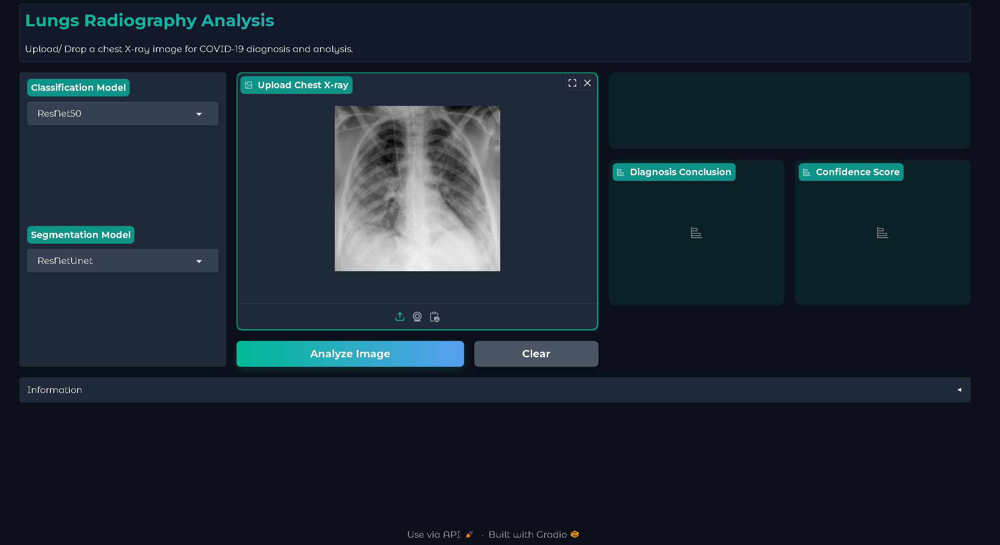

# medical-image-segmentation
A mini project of group 13 studying Intro to Deep Learning course at Hanoi University of Science &amp; Technology

*Instructions to run below*

<p align="center">
  
</p>

## Features
The project will allow you to classify lung radiography images into 3 types

* Normal (Lung is healthy)
* COVID (The person has covid)
* Non-COVID (The person doesn't have COVID but suffers different lung-related issues)

If a patient is diagnosed with COVID, the pipeline will segment the COVID-diagnosed radiography image further for better prescriptions and treatments

## Instructions to use

* Firstly, clone the repository's main branch into your desired directory using your git command prompt.

```git clone -b main https://github.com/king17pvp/medical-image-segmentation.git```

* Secondly, you can access the directory by this command.

```cd medical-image-segmentation```

* Thirdly, install required libraries via requirement.txt
```pip install -r requirements.txt```

* Next, go to https://drive.google.com/drive/folders/1hcFRbwaR2sFW6akC5lkkSu3H3rJpvvcj?usp=sharing and download **ALL** the models and put them in the following directories, otherwise, the inference program will not work. The place where models are located should follow the directory tree below:
```md
medical-image-segmentation/weights
├── segmentation_models
│   ├── AttUNet.pt
│   ├── R2UNet.pt
│   ├── R2AttUNet.pt
│   ├── full_lungs_resnet.pt
│   ├── ResNetUNet.pt
│   └── .gitignore
├── classification_models
│   ├── VGG16.pth
│   ├── VGG19.pth
│   ├── ResNet18.pt
│   ├── ResNet50.pt
│   └── .gitignore
└── .gitignore
```

* Finally, run the project by 

```python app.py```
## 
